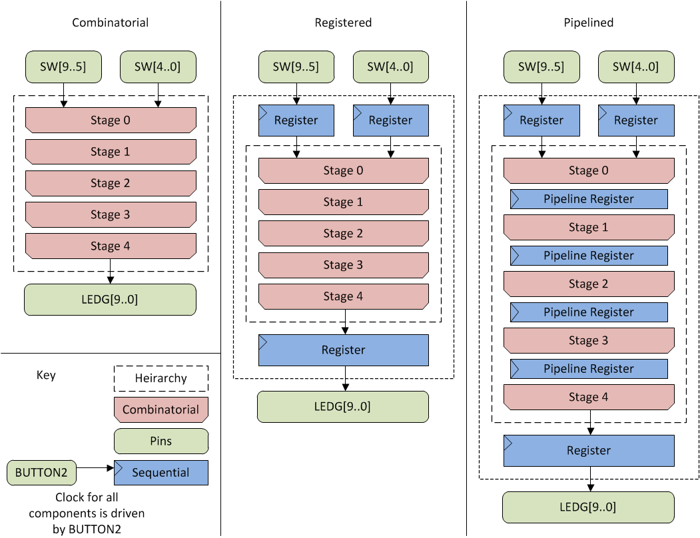

Back to [main](readme.md)

--------------------------------------------------

3 - Pipelined multiplier
========================

Multiplication is a form of repeated addition, and
while there are some [multiplier blocks](https://www.altera.com/products/fpga/cyclone-series/cyclone-ii/features/move-2-cyclone3/cy3-dspblocks.html)
built into the FPGA, it is useful to know how they are constructed.
The notion of pipelining is also an important concept
for your project - how can we (and why do we) split
one operation across multiple consecutive cycles?

Your task is to implement a 5-bit x 5-bit multiplier,
which takes two 5-bit numbers from the toggle switches,
and shows the 10-bit product on the LEDs. There should
be three different variants (top-levels) that you can
configure:
- mult_comb : A combinatorial multiplier, where the output immediately reflects the input.
- mult_reg : A registered multiplier, where there are registers before and after the multiplier, so it takes two clock cycles to perform a multiplication.
- mult_pipe : A fully pipelined multiplier, where there are also registers within the multiplier, so it takes multiple cycles to perform the multiplication.

The "clock" for this example will be the push-button BUTTON2,
which will drive the clock inputs of the registers. Every button
push creates a clock edge, which will drive the inputs forward.



Multiplication algorithm
------------------------

5-bit multiplication can be expressed as:
```
// a and b are 5-bit numbers
unsigned multiply(unsigned a, unsigned b)
{
  unsigned r=0;
  for(unsigned i=0; i<5; i++){ // Loop over 5 bits of a
    r=r*2; // Shift r left by one bit
    if(a&0x10){ // Test whether a[4] (the MSB) is 1
      r=r+b;
    }
    a=a*2;	// Shift a left by one bit
  }
  return r;
}
```
It is strongly suggested you try running this
program to make sure you understand how it works.

This program is iterative, and could in principle
be turned into a multi-cycle hardware implementation,
but we want to build a pipelined multiplier.

Notice that it is possible to [unroll](http://en.wikipedia.org/wiki/Loop_unrolling)
the loop: there are five iterations, and the body
of each iteration is the same. If we use the syntax
`a_{i}` to represent the value of a before iteration
i (or equivalently, after iteration i+1), then each
loop iteration applies a mapping
```
  (a_{i+1},b_{i+1},r_{i+1}) <- loop_body(a_{i},b_{i},r_{i})
```
and if we take `a_{0}`=a, `b_{0}`=b, and `r_{0}`=0,
we find that `r_{5}` is the result of the multiplication.
So five sequential copies of the loop body will also
perform multiplication.

Again, you are encouraged to try unrolling the loop
in C, to check that you understand how it works,
and that it still does the same thing in 5 stages
without a loop as it did using 5 iterations with a loop.

Multiplication hardware
-----------------------

Each loop body can be expressed as a combinatorial
block, which maps one (a,b,r) triple to the next.
Five of these blocks connected end to end will result
in a multiplier, as shown in the figure on the left. It
is suggested that you:

1. Develop the combinatorial version and check it in simulation
2. Test the combinatorial version in hardware as the top-level.
3. Build and test the registered version top-level with the combinatorial
    multiplier as a contained block.
4. Use the registered top-level as the basis for the pipelined
    top-level, with a new pipelined multiplier block.

Comments
--------

A natural question is, well, why... what is the point
of these registers? The two types of registers
provide us with different benefits.

Input/output registers ensure that the internal
signals are stable within one clock-period. In
the registered version, the multiplier is guaranteed
that the inputs will not change between clock
edges, no matter how many times you toggle the
switches. Similarly, the output that you can
see will remain stable, even as the multiplier
is calculating the result.

Try running a timing-driven simulation of the combinatorial
multiplier (i.e. a simulation that takes into account gate
delays) using a sequence of pairs of numbers,
and notice that it takes time for the multiplier
output to settle. The settling time is determined
partially by the input data, but is bounded by
the _critical path_ of the circuit: what is the
longest combinational path? Using an output
register guarantees that we will only see the
final stable result, though we will have to wait one
clock cycle to see it.

Pipelining takes this idea further: think about
the critical path through your registered multiplier,
then think about the critical path in your
pipelined multiplier. In the pipelined version
we have to wait more cycles to see the output,
but each of those cycles could be much faster.

A good exercise (it doesn't need to be done in lab) is
to build a larger multiplier, for example a 16 x 16,
32 x 32, and/or 64 x 64 multiplier, and look at the "Timing Analysis"
for a pipelined versus a registered design (you don't need
to connect it to hardware). You should see a significant
difference between the clock-rates that can
be achieved.

This highlights a final property of registering
and pipelining, which is particularly relevant to
your project: pipelines allow calculations to be
split into multiple stages, so:
- It takes multiple cycles to complete any one
  calculation.
- A new input can be supplied each cycle.
- Once the pipeline is full, a new result can be
  delivered each cycle.

So the _latency_ of the calculation may increase,
but if the clock rate rises, then the _throughput_
of the circuit will increase at the same rate.
Consider two alternative multipliers:
- A 50MHz single-cycle multiplier
- A 200MHz five-stage multiplier

Which has the higher throughput (calculations/sec)
and which has the higher latency (sec/calculation)?

--------------------------------------------------

Back to [main](readme.md)
